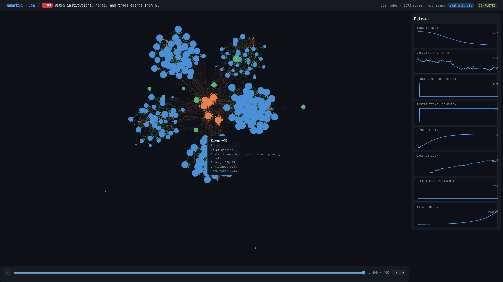
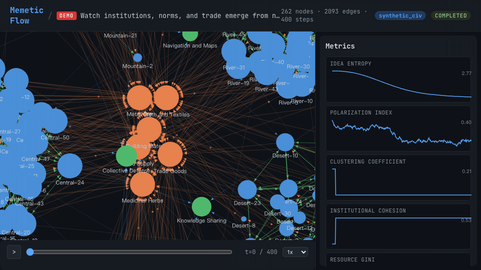
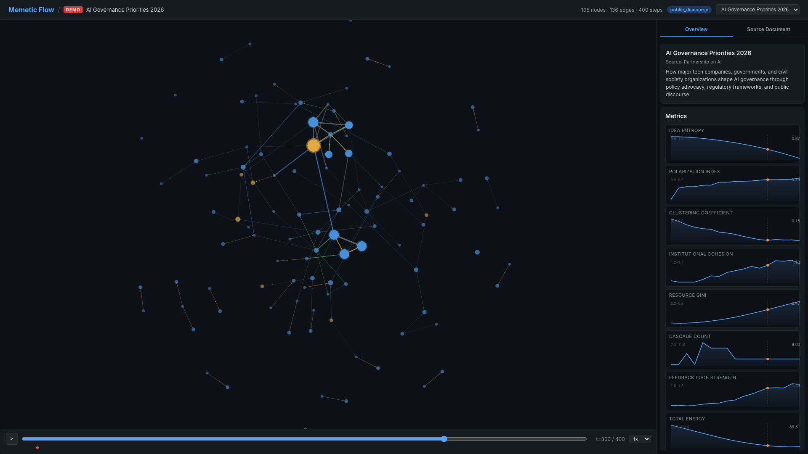
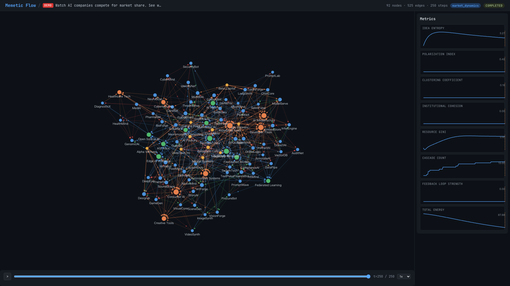
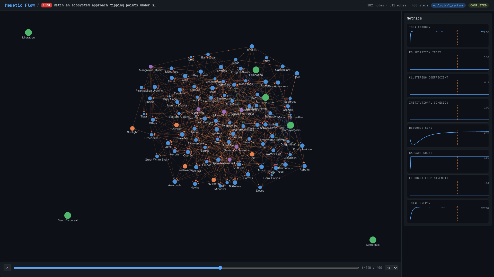

<div align="center">

# Memetic Flow

**アイデアのための物理エンジン。**

*ドキュメントを生きたシミュレーションに変換 — 制度の創発、アイデアの競争、生態系の進化、市場の形成を、複雑系科学に基づく動力学方程式で観察。*

[](LICENSE)
[](https://python.org)
[](https://vuejs.org)
[](https://d3js.org)
[](https://docs.anthropic.com)

[English](./README.md) | [简体中文](./README-CN.md) | [繁體中文](./README-TW.md) | [日本語](./README-JP.md)

### **[ライブデモ — 今すぐ試す](https://dns-wq.github.io/memetic-flow/)**

[](https://dns-wq.github.io/memetic-flow/)

*インストール不要。3つの実データシナリオ、インタラクティブなフォースグラフ、メトリクス、タイムラインリプレイ。*

</div>

---

<div align="center">

<br/><em>ゼロからの文明 — 262エージェントが制度と貿易ネットワークに自己組織化</em>
</div>

<br/>

<div align="center">

<br/><em>400タイムステップで文明が創発 — 制度の形成、規範の伝播、交易路の結晶化</em>
</div>

---

## Memetic Flow とは？

Memetic Flow は、[MiroFish](https://github.com/666ghj/MiroFish) マルチエージェントフレームワーク上に構築された**統一動力学シミュレーションエンジン**です。MiroFish がエージェントの会話をシミュレートするのに対し、Memetic Flow は**明示的な数学的動力学** — 拡散方程式、レプリケータダイナミクス、意見モデル、資源競争、フィードバックループ — を有向辺を持つ型付きグラフ上で実行します。

ドキュメントをアップロードすると、システムがエンティティと関係を抽出して型付きグラフを構築。シミュレーションモードを選択すれば、ネットワーク科学、進化ゲーム理論、複雑系研究に基づく方程式から複雑系が創発します。

**MiroFish との主な違い：**

| | MiroFish | Memetic Flow |
|---|---|---|
| **動力学** | LLM エージェントの会話 | 数学テンプレート方程式 |
| **構造** | 自由テキストインタラクション | 型付きグラフ（5種のノード、6種のエッジ） |
| **出力** | ナラティブとレポート | 再現可能な軌跡 + メトリクス |
| **計測** | 定性的 | 定量的（エントロピー、ジニ係数、分極指数等） |
| **可視化** | チャットログ | D3.js フォースグラフ + アニメーションパーティクルフロー |
| **テキスト理解** | エージェント行動の駆動のみ | LLM分析が数学方程式にフィードバック |

---

## 主な特徴

### LLM駆動の数学的ダイナミクス

最も革新的な機能：Memetic Flow は Claude を使用してエージェントのソーシャルメディア投稿の*内容*を分析し、構造化されたシグナルを数学方程式にフィードバックします。感情、説得力、新規性のスコアが、伝送率、エッジ重み、エネルギーフローを変調します。

### 9つの数学テンプレートファミリー

明示的な更新方程式：

| テンプレート | 理論的基盤 | 計算内容 |
|---|---|---|
| **拡散** | ネットワークカスケードモデル | エッジに沿ったエネルギー伝播と減衰 |
| **意見ダイナミクス** | Hegselmann-Krause モデル | 有界信頼度による信念更新 |
| **進化** | レプリケータダイナミクス | 適応度に比例したアイデア競争 |
| **資源フロー** | Lotka-Volterra 方程式 | ロジスティック成長 + 競争排除 |
| **フィードバックシステム** | システムダイナミクス | 飽和を伴う循環因果 |
| **感染** | SIR/SEIR 疫学 | コンパートメント状態遷移 |
| **ゲーム理論** | 進化ゲーム理論 | 模倣ダイナミクスによる繰り返しゲーム |
| **ネットワーク進化** | ホモフィリーモデル | 類似度に基づくトポロジー再配線 |
| **記憶ランドスケープ** | 文化進化 | 持続性と共鳴を持つ共有文化記憶 |

### インタラクティブなフォースグラフ可視化

Canvas レンダリングの D3.js フォースグラフ。動的パーティクルフロー、リッチなツールチップ、ズーム・パン・ドラッグなどの完全なインタラクション機能を搭載。

---

## スクリーンショット

<div align="center">
<table>
<tr>
<td width="50%"><br/><em>ゼロからの文明 — 262ノード</em></td>
<td width="50%"><br/><em>ソーシャルメディア規制 — 分極化ダイナミクス</em></td>
</tr>
<tr>
<td><br/><em>AIスタートアップエコシステム — 市場競争</em></td>
<td><br/><em>生態系崩壊 — 85種の食物網</em></td>
</tr>
</table>
</div>

---

## シミュレーションモード

8つのシミュレーションモード：

| モード | 使用テンプレート | シミュレーション内容 |
|---|---|---|
| **合成文明** | 拡散、意見、資源、フィードバック | 制度の創発、規範形成、貿易ネットワーク |
| **デジタル心智エコシステム** | 進化、拡散、資源 | 認知生態学、注意力競争、戦略選択 |
| **ミーム物理学** | 拡散、進化、フィードバック | アイデア＝粒子 — エネルギー、重力井戸、ミーム選択 |
| **市場ダイナミクス** | 資源、拡散、フィードバック | 競争市場、サプライチェーン、一人勝ち |
| **公共言説** | 意見、拡散、フィードバック | 分極化、連合形成、エコーチェンバー |
| **知識エコシステム** | 拡散、進化、資源 | 発見、パラダイムシフト、引用ネットワーク |
| **生態系** | 資源、進化、フィードバック | 種間相互作用、生息地崩壊、ティッピングポイント |
| **カスタム** | 任意の組み合わせ | テンプレートとパラメータを完全制御 |

---

## デモシナリオ

4つのプリランシミュレーションを内蔵 — API キーなしで探索可能：

| デモ | モード | ノード数 | ステップ | 概要 |
|---|---|---|---|---|
| **ゼロからの文明** | 合成文明 | 262 | 400 | 5つの地理的クラスターの200エージェントから制度・規範・貿易が創発 |
| **ソーシャルメディア規制** | 公共言説 | 178 | 250 | 賛成/反対陣営の分極化、穏健派が両極へ引き寄せられる |
| **AIスタートアップエコシステム** | 市場ダイナミクス | 120 | 250 | 8セクターの80社が競争、VCが一人勝ちを加速 |
| **生態系崩壊** | 生態系 | 85 | 400 | キーストーン資源の劣化による連鎖的な種の危機 |

全デモの全エージェントが**固有の役割と目標**を持っています — ノードにホバーして詳細を確認。

---

## クイックスタート

### 前提条件

| ツール | バージョン | 確認 |
|---|---|---|
| **Node.js** | 18+ | `node -v` |
| **Python** | 3.11-3.12 | `python3 --version` |
| **uv** | 最新版 | `uv --version` |

### 1. 環境設定

```bash
cp .env.example .env
# .env を編集 — ANTHROPIC_API_KEY を設定（ドキュメント解析用）
# デモシナリオは API キーなしで動作
```

### 2. 依存関係のインストール

```bash
npm run setup:all
```

### 3. 起動

```bash
npm run dev
```

- フロントエンド：`http://localhost:3000`
- バックエンド API：`http://localhost:5001`
- デモ：`http://localhost:3000/demo/civilization_from_scratch`

### Docker デプロイ

```bash
cp .env.example .env
docker compose up -d
```

---

## 理論的背景

Memetic Flow は以下の分野を基盤としています：

- **ネットワーク科学** — Barabasi（スケールフリーネットワーク）、Watts & Strogatz（スモールワールド）
- **意見ダイナミクス** — Hegselmann-Krause（有界信頼度）、DeGroot（合意モデル）
- **進化ゲーム理論** — Maynard Smith（ESS）、Nowak（グラフ上の進化ダイナミクス）
- **システムダイナミクス** — Forrester（ストック＆フロー）、Meadows（レバレッジポイント）
- **ミーム学** — Dawkins（利己的な遺伝子）、Blackmore（ミームマシン）
- **複雑系科学** — Holland（創発）、Kauffman（自己組織化）
- **生態学モデリング** — Lotka-Volterra（捕食者-被食者）、May（安定性と複雑性）
- **制度経済学** — North（ルールとしての制度）、Ostrom（集合行為）

---

## 謝辞

Memetic Flow は **[MiroFish](https://github.com/666ghj/MiroFish)**（盛大グループ MiroFish チーム）のフォークプロジェクトです。OASIS マルチエージェントシミュレーションエンジンは **[CAMEL-AI](https://github.com/camel-ai/oasis)** によるものです。

オリジナルの AGPL-3.0 ライセンスを継承し、これらの基盤プロジェクトに心より感謝いたします。

---

## ライセンス

[AGPL-3.0](LICENSE) — MiroFish と同一。
