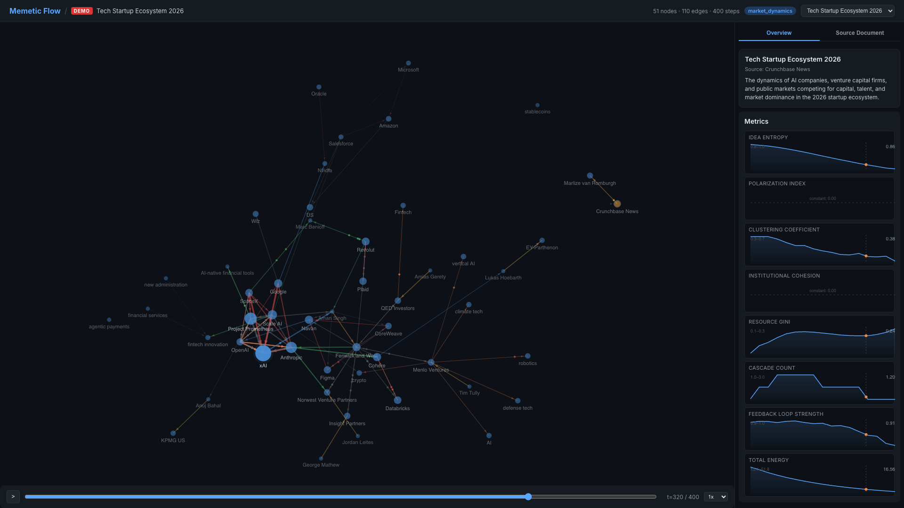
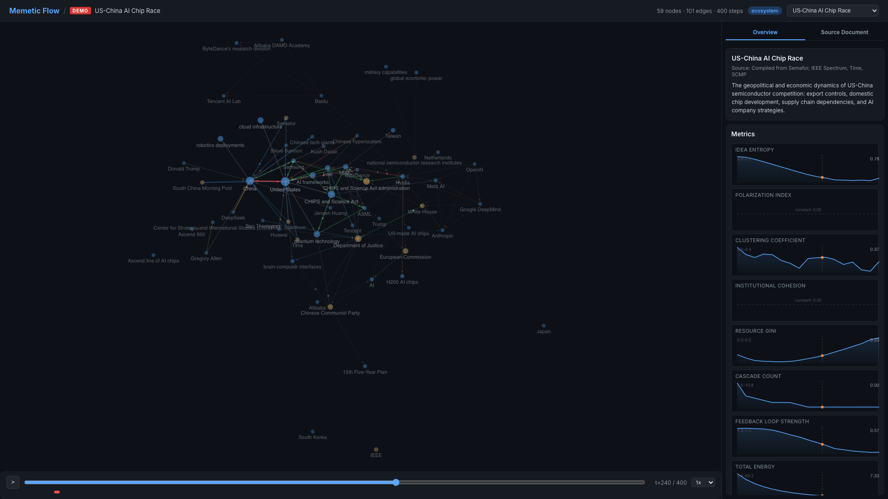
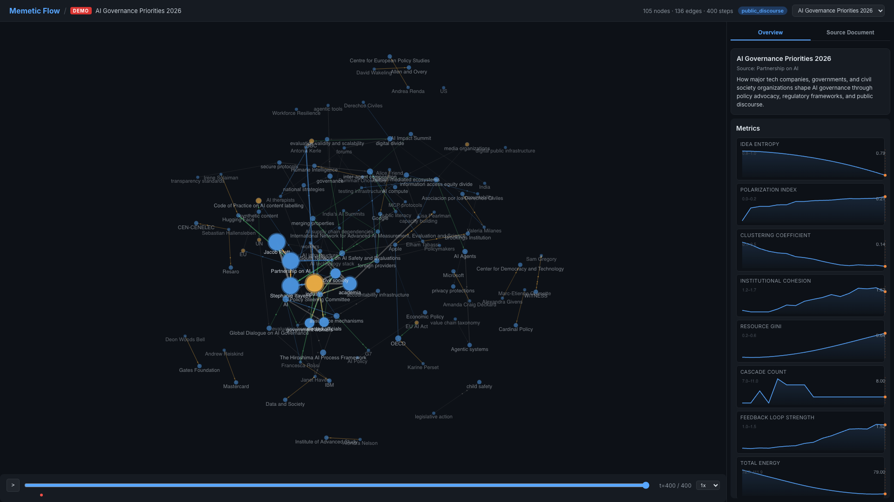

<div align="center">

# Memetic Flow

**A physics engine for ideas.**

*Transform documents into living simulations — watch institutions emerge, ideas compete, ecosystems evolve, and markets form through dynamical equations grounded in complexity science.*

[](LICENSE)
[](https://python.org)
[](https://vuejs.org)
[](https://d3js.org)
[](https://docs.anthropic.com)

[English](./README.md) | [简体中文](./README-CN.md) | [繁體中文](./README-TW.md) | [日本語](./README-JP.md)

### **[Live Demo — Try it now](https://dns-wq.github.io/memetic-flow/)**

[](https://dns-wq.github.io/memetic-flow/)

*No installation required. 3 real-world scenarios with interactive force graphs, metrics, and timeline replay.*

</div>

---

<div align="center">

<br/><em>AI Governance Priorities 2026 — 105 nodes modeling policy discourse across governments, tech companies, and civil society</em>
</div>

<br/>

<div align="center">

<br/><em>Watch AI governance dynamics unfold over 400 timesteps — coalitions form, polarization shifts, policy discourse evolves</em>
</div>

---

## What is Memetic Flow?

Memetic Flow is a **unified dynamical simulation engine** built on top of the [MiroFish](https://github.com/666ghj/MiroFish) multi-agent framework. Where MiroFish simulates agent conversations, Memetic Flow adds **explicit mathematical dynamics** — diffusion equations, replicator dynamics, opinion models, resource competition, and feedback loops — all running on typed graphs with directed edges.

Upload a document. The system extracts entities and relationships into a typed graph. Choose a simulation mode. Watch complex systems emerge through equations grounded in network science, evolutionary game theory, and complexity research.

**Key differences from MiroFish:**

| | MiroFish | Memetic Flow |
|---|---|---|
| **Dynamics** | LLM agents chatting | Mathematical template equations |
| **Structure** | Free-form text interactions | Typed graph with 5 node types, 6 edge types |
| **Output** | Narratives and reports | Reproducible trajectories + metrics |
| **Measurement** | Qualitative | Quantitative (entropy, Gini, polarization, etc.) |
| **Visualization** | Chat logs | D3.js force graph with animated particle flows |
| **Text understanding** | Drives agent behavior only | LLM analysis feeds back into the math |

---

## Key Features

### LLM-Informed Mathematical Dynamics

The most novel feature: Memetic Flow uses Claude to analyze the *content* of agent social media posts, then feeds structured signals back into the mathematical equations. A thoughtful policy analysis and a flame war produce different dynamics — not because an LLM decided, but because sentiment, persuasiveness, and novelty scores modulate the transfer rates, edge weights, and energy flows in the underlying math.

```
Agent posts "AI will eliminate 40% of jobs within a decade"
    │
    ▼
TextAnalyzer (Claude API)
    │  sentiment: -0.6    persuasiveness: 0.8    novelty: 0.3
    ▼
Mathematical dynamics update:
    • Influence gain: 0.02 + 0.8 × 0.08 = 0.084 (vs fixed 0.05)
    • Conflict edge weight: 0.3 + 0.6 × 0.4 = 0.54
    • Topic relevance → new edges to related idea nodes
```

### 9 Mathematical Template Families

Explicit update equations, not LLM improvisation:

| Template | Foundation | What It Computes |
|---|---|---|
| **Diffusion** | Network cascade models | Energy propagation along edges with decay |
| **Opinion Dynamics** | Hegselmann-Krause model | Bounded-confidence belief updating |
| **Evolutionary** | Replicator dynamics | Fitness-proportional idea competition |
| **Resource Flow** | Lotka-Volterra equations | Logistic growth + competitive exclusion |
| **Feedback Systems** | System dynamics (stocks & flows) | Circular causation with saturation |
| **Contagion** | SIR/SEIR epidemiology | Compartmental state transitions |
| **Game Theory** | Evolutionary game theory | Repeated games with imitation dynamics |
| **Network Evolution** | Homophily models | Topology rewiring based on similarity |
| **Memory Landscape** | Cultural evolution | Shared cultural memory with persistence and resonance |

All templates have empirical priors from published research, so simulations produce reasonable dynamics out of the box.

### Interactive Force Graph Visualization

Canvas-rendered D3.js force graph with:
- **Variable node sizing** — radius scales with energy, so important nodes stand out
- **Variable charge** — high-energy nodes repel more, creating natural hierarchy
- **Edge-type-aware layout** — membership edges create tight institutional clusters, influence edges allow loose coupling
- **Animated particle flow** — colored particles stream along edges showing energy transfer direction and rate
- **Rich tooltips** — hover any node to see its role, goals, description, and live state values
- **Zoom, pan, drag** — full interactivity with zoom-to-fit on double-click

### 10 System-Level Metrics + Phase Transition Detection

Every simulation step computes:

| Metric | What It Measures |
|---|---|
| **Idea Entropy** | Diversity of idea energy distribution (Shannon entropy) |
| **Polarization Index** | Mean pairwise ideological distance |
| **Clustering Coefficient** | Fraction of closed triplets (community structure) |
| **Institutional Cohesion** | Average intra-institutional edge density |
| **Resource Gini** | Inequality of resource distribution |
| **Cascade Count** | Nodes with energy > 2x mean (active cascades) |
| **Feedback Loop Strength** | Average weight of edges in feedback loops |
| **Total Energy** | Sum of all node energies |
| **Node / Edge Count** | Graph size tracking |

The **Phase Transition Detector** monitors metric derivatives over sliding windows and flags abrupt regime changes — polarization spikes, institutional collapse, cascade events — as named events on the timeline.

---

## Screenshots

<div align="center">
<table>
<tr>
<td width="50%"><br/><em>AI Governance — 105 nodes, policy discourse</em></td>
<td width="50%"><br/><em>AI Governance — metrics dashboard at t=300</em></td>
</tr>
<tr>
<td><br/><em>Tech Startup Ecosystem — market dynamics</em></td>
<td><br/><em>US-China Chip Race — geopolitical dynamics</em></td>
</tr>
<tr>
<td colspan="2"><br/><em>Phase transition — emergent cluster formation with rich node metadata tooltips</em></td>
</tr>
</table>
</div>

---

## Simulation Modes

8 simulation modes, each bundling specific templates, parameters, and visualization presets:

| Mode | Templates | What It Models |
|---|---|---|
| **Synthetic Civilizations** | Diffusion, Opinion, Resource, Feedback | Institutional emergence, norm formation, trade networks |
| **Digital Ecosystem of Minds** | Evolutionary, Diffusion, Resource | Cognitive ecology, attention competition, strategy selection |
| **Memetic Physics** | Diffusion, Evolutionary, Feedback | Ideas as particles — energy, gravity wells, memetic selection |
| **Market Dynamics** | Resource, Diffusion, Feedback | Competitive markets, supply chains, winner-takes-all |
| **Public Discourse** | Opinion, Diffusion, Feedback | Polarization, coalition formation, echo chambers |
| **Knowledge Ecosystems** | Diffusion, Evolutionary, Resource | Discovery, paradigm shifts, citation networks |
| **Ecological Systems** | Resource, Evolutionary, Feedback | Species interactions, habitat collapse, tipping points |
| **Custom** | Any combination | Manual template selection with full parameter control |

---

## Demo Scenarios

3 pre-run simulations are included — no API keys needed to explore:

| Demo | Mode | Nodes | Steps | What Happens |
|---|---|---|---|---|
| **[AI Governance 2026](https://dns-wq.github.io/memetic-flow/#/demo/ai_governance)** | Public Discourse | 105 | 400 | Tech companies, governments, and civil society shape AI policy through advocacy and regulation |
| **[Tech Startup Ecosystem](https://dns-wq.github.io/memetic-flow/#/demo/tech_startups)** | Market Dynamics | 51 | 400 | AI companies and VCs compete for capital, talent, and market dominance |
| **[US-China Chip Race](https://dns-wq.github.io/memetic-flow/#/demo/chip_race)** | Ecosystem | 59 | 400 | Geopolitical semiconductor competition: export controls, supply chains, and AI strategy |

Every entity has a **unique role and relationships** — hover any node to see its description, goals, and live state values.

**[Try the live demo →](https://dns-wq.github.io/memetic-flow/)**

---

## Architecture

```
Document Upload
       |
       v
+---------------------+
| Interpretation Layer |  Claude API: extract entities, relations, causal claims
| (modified MiroFish)  |  -> typed graph primitives
+----------+----------+
           v
+---------------------+
|  Typed Graph Model   |  5 node types (Agent, Institution, Idea, Resource, Environment)
|                      |  6 edge types (Influence, Information, Resource Flow, ...)
+----------+----------+
           v
+---------------------------------------------+
|           Simulation Engine                  |
|  +----------+    +------------------------+  |
|  |  OASIS   |<-->| 9 Template Families    |  |
|  | (agents) |    | (explicit equations)   |  |
|  +----------+    +----+-------------------+  |
|       |               |                      |
|  +----v----+    +-----v--------+             |
|  |  Text   |    | TextAnalyzer |             |
|  | actions |    | (Claude API) |             |
|  +---------+    | sentiment,   |             |
|                 | persuasive,  |             |
|                 | novelty      |             |
|                 +--------------+             |
+-----------+---------------------+------------+
            v                     v
+---------------------+  +------------------+
| Measurement Layer   |  | Visualization    |
| 10 metrics tracked  |  | D3.js force graph|
| Phase transition    |  | Particle flow    |
| detection           |  | Temporal replay  |
+---------------------+  | Metrics dashboard|
                          +------------------+
```

See [`docs/diagrams/architecture.mmd`](docs/diagrams/architecture.mmd) for the full Mermaid diagram.

---

## Quick Start

### Prerequisites

| Tool | Version | Check |
|---|---|---|
| **Node.js** | 18+ | `node -v` |
| **Python** | 3.11-3.12 | `python3 --version` |
| **uv** | Latest | `uv --version` |

### 1. Configure environment

```bash
cp .env.example .env
# Edit .env -- set ANTHROPIC_API_KEY (for document interpretation)
# Demos work without any API key
```

### 2. Install dependencies

```bash
npm run setup:all
```

### 3. Start

```bash
npm run dev
```

- Frontend: `http://localhost:3000`
- Backend API: `http://localhost:5001`
- Demos: `http://localhost:3000/demo/civilization_from_scratch`

### Docker

```bash
cp .env.example .env
docker compose up -d
```

---

## Project Structure

```
backend/app/
  dynamics/          # Typed graph data model (nodes, edges, snapshots)
  engine/
    templates/       # 9 mathematical template families
    runner.py        # Simulation orchestrator
    oasis_bridge.py  # OASIS agent actions -> graph updates
    text_analyzer.py # LLM content analysis -> structured signals
  modes/             # 8 simulation modes (7 curated + custom)
  metrics/           # Metric computation + phase transition detection
  api/dynamics.py    # REST API endpoints

frontend/src/
  components/
    DynamicsGraphPanel.vue   # D3.js canvas force graph + particles
    MetricsDashboard.vue     # Time-series metric charts
    TemporalSlider.vue       # Timeline scrubber with events
  views/
    DemoView.vue             # Pre-run demo viewer

demo/
  data/              # Pre-generated simulation data (JSON)
  generators/        # Demo scenario definitions
```

---

## API Reference

```
POST   /api/dynamics/initialize              Create dynamics graph from project
GET    /api/dynamics/graph/<sim_id>           Current graph state
GET    /api/dynamics/snapshot/<sim_id>/<ts>   Historical snapshot at timestep
GET    /api/dynamics/templates                Available templates
POST   /api/dynamics/configure               Set templates + parameters
GET    /api/dynamics/parameters/<template>    Parameter specs + priors
POST   /api/dynamics/start                   Start simulation
POST   /api/dynamics/stop                    Stop simulation
GET    /api/dynamics/status/<sim_id>          Simulation progress
GET    /api/dynamics/metrics/<sim_id>         Metric time series
GET    /api/dynamics/events/<sim_id>          Phase transition events
POST   /api/dynamics/inject-event            Manual parameter shock
GET    /api/dynamics/demos                   List demo scenarios
POST   /api/dynamics/demo/<name>/load        Load pre-run demo
```

---

## Intellectual Foundations

Memetic Flow draws on:

- **Network Science** — Barabasi (scale-free networks), Watts & Strogatz (small worlds)
- **Opinion Dynamics** — Hegselmann-Krause (bounded confidence), DeGroot (consensus)
- **Evolutionary Game Theory** — Maynard Smith (ESS), Nowak (evolutionary dynamics on graphs)
- **System Dynamics** — Forrester (stocks and flows), Meadows (leverage points)
- **Memetics** — Dawkins (The Selfish Gene), Blackmore (The Meme Machine)
- **Complexity Science** — Holland (emergence), Kauffman (self-organization)
- **Ecological Modeling** — Lotka-Volterra (predator-prey), May (stability and complexity)
- **Institutional Economics** — North (institutions as rules), Ostrom (collective action)

---

## Acknowledgments

Memetic Flow is a fork of **[MiroFish](https://github.com/666ghj/MiroFish)** by the MiroFish team at Shanda Group. The OASIS multi-agent simulation engine is by **[CAMEL-AI](https://github.com/camel-ai/oasis)**.

We retain the original AGPL-3.0 license and gratefully acknowledge these foundational projects.

---

## License

[AGPL-3.0](LICENSE) — same as MiroFish.

Memetic Flow additions are copyright their respective contributors.
Original MiroFish code is copyright the MiroFish team / Shanda Group.
